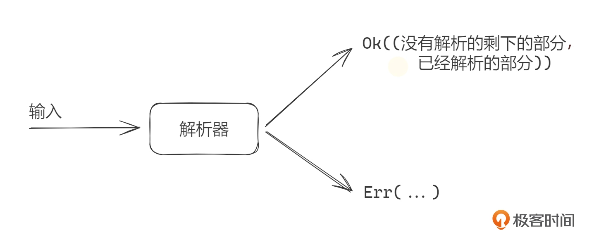

# 解析器是什么？
解析器其实很简单，就是把一个字符串或字节串解析成某种类型。对应的，在 Rust 语言里就是把一个字段串解析成一个 Rust 类型。一个 Parser 其实就是一个 Rust 函数。

这个转换过程有很多种方法。

1. 最原始的是完全手撸，一个字符一个字符吞入解析。
2. 对一些简单情况，直接使用 String 类型中的 find、split、replace 等函数就可以。
3. 用正则表达式能够解析大部分种类的文本。
4. 还可以用一些工具或库帮助解析，比如 Lex、Yacc、LalrPop、Nom、Pest 等。
5. Rust 语言的宏也能用来设计 DSL，能实现对 DSL 文本的解析。

这节课我们只关注第 4 点。在所有辅助解析的工具或库里，我们只关心 Rust 生态辅助解析的库。

# Rust 生态中主流的解析工具

目前 Rust 生态中已经有几个解析库用得比较广泛，我们分别来了解下。
* LalrPop https://crates.io/crates/lalrpop 类似于 Yacc，用定义匹配规则和对应的行为方式来写解析器。
* Pest https://crates.io/crates/pest 使用解析表达式语法（Parsing Expression Grammar，PEG）来定义解析规则，PEG 已经形成了一个成熟的标准，各种语言都有相关的实现。
* Nom 是一个解析器组合子（Parser-Combinator）库，用函数组合的方式来写规则。一个 Parser 就是一个函数，接收一个输入，返回一个结果。而组合子 combinator 也是一个函数，用来接收多个 Parser 函数作为输入，把这些小的 Parser 组合在一起，形成一个大的 Parser。这个过程可以无限叠加。

Nom 库介绍

这节课我们选用 Nom 库来讲解如何快速写出一个解析器，目前（2023 年 12 月）Nom 库的版本为 v7.1。选择 Nom 的原因是，它可以用来解析几乎一切东西，比如文本协议、二进制文件、流数据、视频编码数据、音频编码数据，甚至是一门完整功能的编程语言。

Nom 的显著特性在安全解析、便捷的解析过程中的错误处理和尽可能的零拷贝上。因此用 Nom 解析库写的代码是非常高效的，甚至比你用 C 语言手撸一个解析器更高效，这里有一些评测（https://github.com/rust-bakery/parser_benchmarks）你可以参考。Nom 能够做到这种程度主要是因为站在了 Rust 的肩膀上。

解析器组合子是一种解析方法，这种方法不同于 PEG 通过写单独的语法描述文件的方式进行解析。Nom 的 slogan 是“nom, eating data byte by byte”，也就是一个字节一个字节地吞，顺序解析。

使用 Nom 你可以写特定目的的小函数，比如获取 5 个字节、识别单词 HTTP 等，然后用有意义的模式把它们组装起来，比如识别 'HTTP'，然后是一个空格、一个版本号，也就是 'HTTP 1.1' 这种形式。这样写出的代码就非常小，容易起步。并且这种形式明显适用于流模式，比如网络传输的数据，一次可能拿不完，使用 Nom 能够边取数据边解析。

解析器组合子思路有 5 个优势。

* 解析器很小，很容易写。
* 解析器的组件非常容易重用。
* 解析器的组件非常容易用单元测试进行独立测试。
* 解析器组合的代码看起来接近于你要解析的数据结构，非常直白。
* 你可以针对你当前的特定数据，构建部分解析器，而不用关心其他数据部分。

# Nom 的工作方式

Nom 的解析器基本工作方式很简单，就是读取输入数据流，比如字符串，返回 (rest, output) 这样一个 tuple，rest 就是没有解析到的字符串的剩余部分，output 就是解析出来的目标类型。很多时候，这个返回结果就是 (&str, &str)。解析过程中，可以处理解析错误。

# 基本解析器和组合子

在 Nom 中，一个 Parser 其实就是一个函数。Nom 提供了一些最底层的 Parser。相当于构建房屋的砖块，我们掌握了这些砖块后，就可以把这些砖块组合使用，像乐高积木，一层层越搭越高。这里我们列举一些常用的解析器，案例基本上都是对字符串的解析。

## Tag

* tag https://docs.rs/nom/latest/nom/bytes/complete/fn.tag.html 非常常用，用来指代一个确定性的字符串，比如 “hello”。
* tag_no_case https://docs.rs/nom/latest/nom/bytes/complete/fn.tag_no_case.html 识别一个确定性的字符串，忽略大小写。

## 基本类别解析器
https://docs.rs/nom/latest/nom/character/complete/index.html

## 基本组合子

* alt：Try a list of parsers and return the result of the first successful one 或组合子，满足其中的一个解析器就可成功返回。
* tuple：和组合子，并且按顺序执行解析器，并返回它们的值为一个 tuple。
* delimited：解析左分界符目标信息右分界符这种格式，比如 "{ ... }"，返回目标信息。
* pair：tuple 的两元素版本，返回一个二个元素的 tutple。
* separated_pair：解析目标信息分隔符目标信息这种格式，比如 "1,2" 这种，返回一个二个元素的 tuple。
* take_while_m_n：解析最少 m 个，最多 n 个字符，这些字符要符合给定的条件。

更多 Nom 中的解析器和组合子的信息请查阅 Nom 的 API。https://docs.rs/nom/latest/nom/index.html